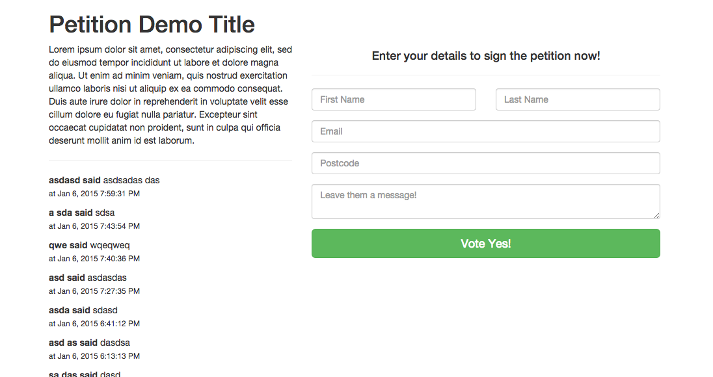

<h1>Momentum.build Petition module for Angular</h1>



<h3>Before starting:</h3>
<p>Make sure you go to http://www.momentum.build to create your campaigns and actions to use with this module.</p>

<h3>Use (Simple):</h3>

<p>1. bower install momentum-actions --save</p>
<p>2. Add angular, actions.js (and actions-tpl.js if you want to use example templates) as scripts in your html</p>
```
<script src="bower_components/angular/angular.min.js"></script>
<script src="bower_components/dist/actions.min.js"></script>
<script src="bower_components/dist/actions-tpl.min.js"></script>
```

<p>3. Add 'momentum.actions' as dependancy to app module.</p>
```
angular.module('actionExample', ['momentum.actions'])
```

<p>4. call directive with campaign and action id's.</p>
```
<example-feed campaign-id="48" action-id="42" action="petition" />
<example-form campaign-id="49" action-id="41" action="petition" />
```

<h3>Use (Custom):</h3>
<p>Custom uncompiled example located in 'src/example'. Uses gulp and jade and compiles to 'example/' folder.</p>

```
<actions-feed campaign-id="48" action-id="42" action="petition">
  <div data-ng-repeat="a in Feed.actions | orderBy:'-createdAt'" class="actionItem">
    <p><b>{{ a.first_name }} said</b> {{ a.message}}<small class="clearfix">at {{ a.createdAt | date : 'medium' }}</small></p>
  </div>
</actions-feed>
```

```
<actions-form campaign-id="48" action-id="42" action="petition"> 
  <form id="actionForm" data-ng-submit="Form.create()">
    <div class="form-group">
      <input type="text" data-ng-model="Form.newAction.first_name" data-ng-required="true" placeholder="First Name" class="form-control">
    </div>
    <div class="form-group">
      <textarea data-ng-model="Form.newAction.message" data-ng-required="true" placeholder="Message" class="form-control"></textarea>
    </div>
    <button class="btn btn-success btn-block btn-lg">Sign Action</button>
  </form>
</actions-form>
```

<h3>API's:</h3>
<p><a href="https://github.com/paulstefanday/Momentum/blob/master/api/models/Submission.js">Form field model options</a></p>
<p><a href="https://github.com/MomentumBuild/angular-actions/blob/master/src/module/app/directives/feed.js">Feed directive example (use templateUrl instead of transclusion)</a></p>
<p><a href="https://github.com/MomentumBuild/angular-actions/blob/master/src/module/app/directives/form.js">Form directive example (use templateUrl instead of transclusion)</a></p>
<p><a href="https://github.com/MomentumBuild/angular-actions/blob/master/src/module/app/service.js">Angular factory for API endpoints</a></p>
<p><a href="https://github.com/MomentumBuild/angular-actions/blob/master/src/module/app/controller.js">Angular controller for actions</a></p>
<p><a href="https://github.com/paulstefanday/Momentum/blob/master/api/models/Action.js">Action model</a></p>